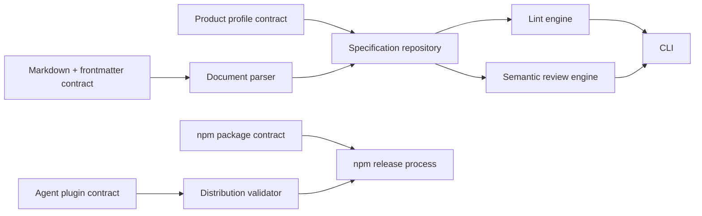

# Spec9 engine specification

This directory is Spec9 describing itself. Start here for a human review, then
follow the linked pages only where more detail is needed.

## System map



## Review from general to specific

1. Review the boundaries in `contracts/`: authoring format, executable profile,
   GitHub release event, npm package, and shared agent plugin.
2. Review the three causal workflows in `processes/`: validation, semantic
   review, and npm publishing.
3. Open a component in `terms/` when a workflow or invariant needs code-level
   evidence.
4. Open `decisions/` only to understand why a constraint exists or what would
   justify changing it.

Run the self-check from the repository root:

```bash
npm run validate:self
```
