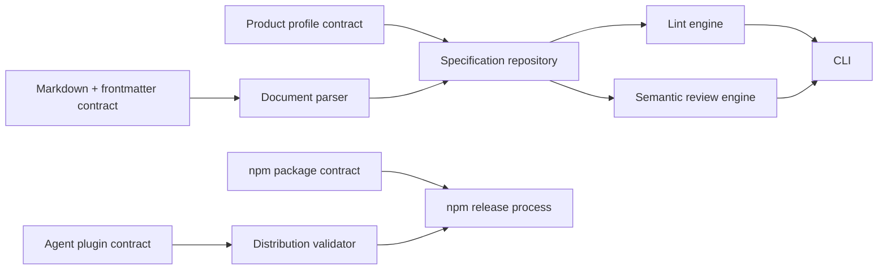

# Spec9 engine specification

This directory is Spec9 describing itself. Start here for a human review, then
follow the linked pages only where more detail is needed.

## Ideas and work in progress

Start in `initiatives/` to capture an idea, problem, or proposal, even before it
has an owner, ADR, requirements, or plan. The first entry is
[One place for ideas, decisions, requirements, and deliveries](initiatives/unified-specification-workspace.md).
Initiatives stay as entry points; they do not become ADRs or requirement pages.

From the repository root, print a new skeleton and save it in `spec9/initiatives/`:

```bash
node plugins/spec9/tools/spec.mjs --spec-root spec9 --product-root . draft initiative engine.my-idea --name "My idea"
```

Replace the placeholder prose with a short description. `status: idea` is
enough to start; `exploring`, `delivering`, `closed`, and `dropped` are available
without introducing ADR acceptance roles. When a decision is needed, add an ADR
with `relations.motivated_by: [engine.my-idea]`. Use ordinary `references` on the
initiative to link existing decisions, domain pages, and work records. Only add
links once their targets exist. No mirrored checklist or requirement copy is
needed.

Products may additionally enable deliveries as described in the
[authoring format](../plugins/spec9/docs/format.md). A raw idea does not need a
delivery; coverage checks apply to requirements linked to effective accepted ADRs.
Completed deliveries cover their exact editions until those requirements change.

## System map


```mermaid
flowchart LR
  Format[Markdown + frontmatter contract] --> Parser[Document parser]
  Profile[Product profile contract] --> Repository[Specification repository]
  Parser --> Repository
  Repository --> Lint[Lint engine]
  Repository --> Review[Semantic review engine]
  Lint --> CLI[CLI]
  Review --> CLI
  Plugin[Agent plugin contract] --> Distribution[Distribution validator]
  Package[npm package contract] --> Publish[npm release process]
  Distribution --> Publish
```

## Review from general to specific

1. Review the boundaries in `contracts/`: authoring format, executable profile,
   GitHub release event, npm package, and shared agent plugin.
2. Review the three causal workflows in `processes/`: validation, semantic
   review, and npm publishing.
3. Open a component in `terms/` when a workflow or invariant needs code-level
   evidence.
4. Open `decisions/` only to understand why a constraint exists or what would
   justify changing it.

Run the self-check from the repository root:

```bash
npm run validate:self
```
